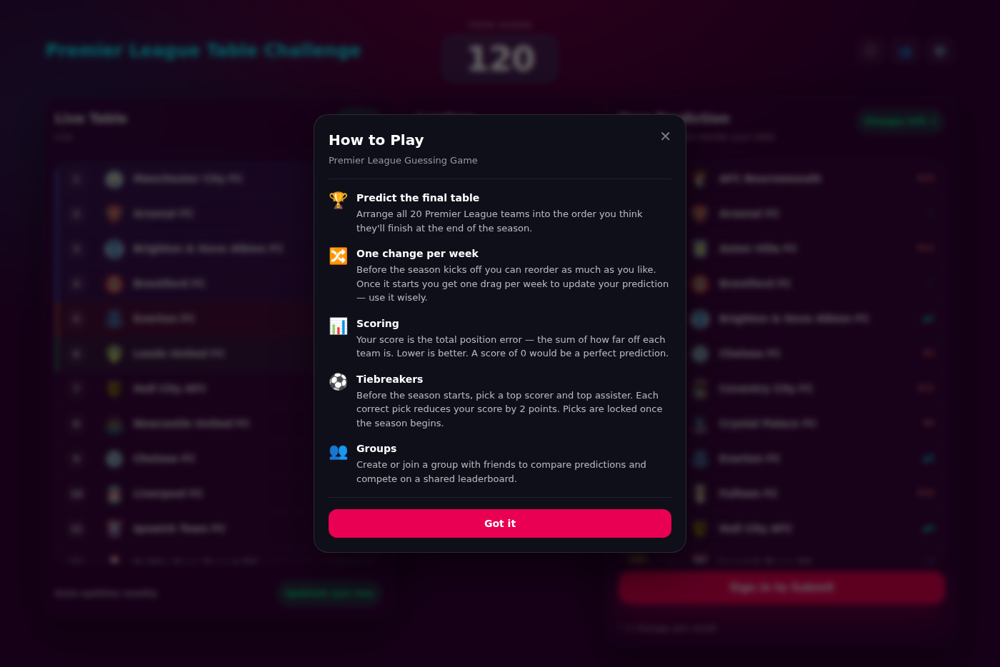

# Premier League Guessing Game ⚽

A React + TypeScript web app where users predict the final Premier League table by dragging teams into order.  
Scores are calculated based on **total positional error** — lower scores are better.

This project currently uses **local dummy data** for the league table and is built with **Vite** for fast development.

## UI


;
---

## 🧠 How the Game Works

- The **Live Table** (left) represents the current / actual standings  
- The **Your Prediction** panel (right) lets users drag teams into their predicted order  
- **Scoring**:
  - For each team:  
    `|predicted position − actual position|`
  - The total score is the sum across all teams  
  - **Lowest score wins**

Example:
- You guess Arsenal finishes **15th**
- They actually finish **4th**
- You receive **11 points** for that team

---

## 🛠 Tech Stack

- **React 19**
- **TypeScript**
- **Vite**
- **@hello-pangea/dnd** (drag & drop)
- **Chakra UI** (installed, optional usage)
- **Framer Motion** (for animations)

---

## 📦 Requirements

- **Node.js** `>= 18`
- **npm** `>= 9`

Check versions:
```bash
node -v
npm -v
